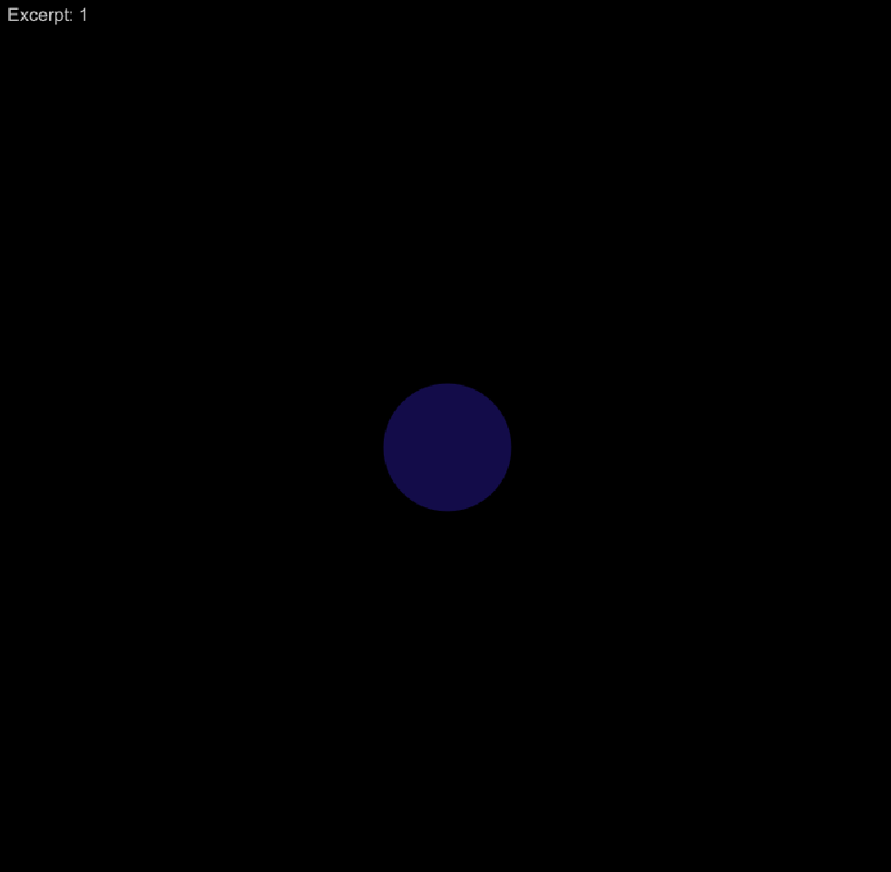
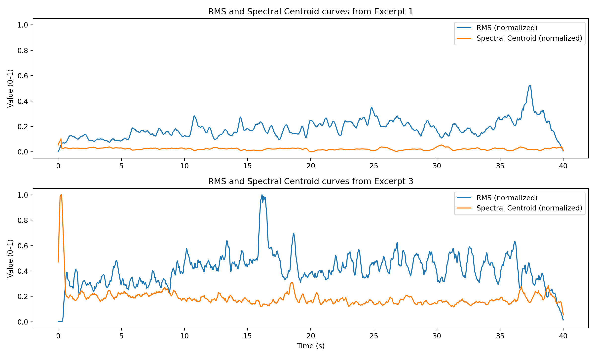
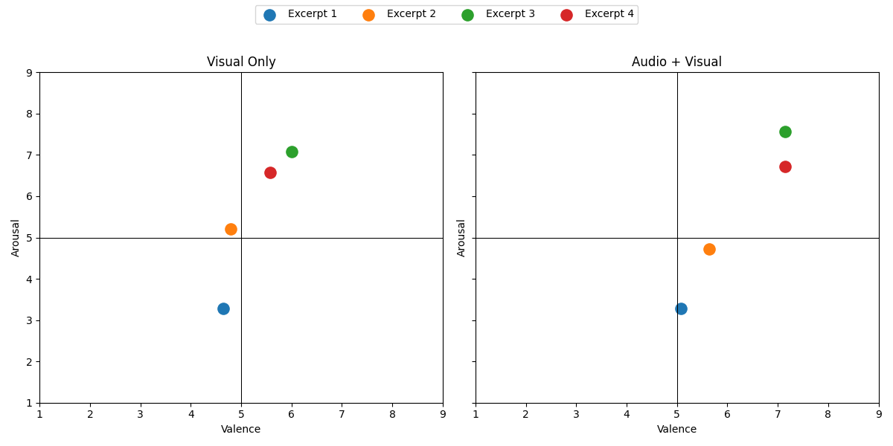

# Exploring Musical Emotion Visualization Through Acoustic Feature Mapping

## Abstract
This project explores whether the emotional qualities of music can be communicated visually by mapping the acustic features, Energy (RMS) and Spectral Centroid, to simple dynamic visual parameters such as movement intensity and color. This is explored using four short instrumental excerpts, each of which conveys an emotion (happiness, sadness). The system perform feature extraction and generates visuals whose temporal evolution is related with the acustic features. A user study compares valence and arousal ratings accross two different tests, visual, and audio+visual, with the goal to evaluate how these visuals approximate or modify the emotional impressions of the music. By examining how visual changes generated from acoustic features evoke emotional responses, the project aims to explore, on a small scale, how musical emotion can be experienced through sight.

---
## Introduction
Music is widely recognized as a powerful medium capable of conveying emotions. Although the emotions generated by music are mainly transmitted through sound, people often describe the experience using visual imagery such as colors, shapes, movements or atmospheres inspired by the music (Dahl et al., 2023). This observation suggests the existence of significant relationships between acoustic structure and visual representation, opening the possibility to investigate how music can be experienced through visual channels.

Unfortunately, the emotions conveyed by music are not accessible to everyone. For people with hearing impairments, these characteristics are difficult or impossible to experience directly through sound. Therefore, creating visual representations that aim to reflect these properties may offer an alternative way to enjoy the emotional qualities of music. However, to reach this point, it is necessary to understand how these aspects of sound can be related and coherently rendered in a visual form. 

To address this challenge, it is essential to identify which musical features are most relevant for the perception of emotions, as well as to determine how these features can be expressed visually. Rather than focusing on the aesthetic design of the visuals, the project approaches the problem from a perceptual perspective.

Therefore, the research question of the project is:

*Can visuals generated from Energy (RMS) and Spectral Centroid evoke emotional impressions similar to those experienced during music listening through changes in movement, color and rhythmic pulsing?*

To address this question, this exploratory study formulates the following hypotheses:

- H1: It is expected that the emotional responses elicited by the visual-only condition will fall within the same or similar quadrant of the valence–arousal space as the emotional responses associated with the selected musical excerpts.

- H2: It is expected that presenting audio and visuals together will produce enhanced emotional responses compared to the visual-only condition.

The project aims to explain and apply correspondences between acustic and visual features supported by previous research. The goal is not to replicate the richness and complexity of music in visual form, but rather to examine how changes in energy (RMS) and spectral centroid can, through variations in movement and color, evoke affective responses that aling with those produced by music.

---
## Theoretical Framework and Related Studies
The emotions conveyed by music are complex and cannot typically be captured with simple labels such as “happy” or “sad.” For this reason, studies on music perception often rely on dimensional models that represent emotion along continuous axes. One of the most influential is the valence–arousal model (Russell, 1980), which positions emotions according to their level of positivity (valence) and level of activation (arousal). This model is widely used in studies comparing emotional responses across audiovisual stimuli, therefore it is a useful framework for evaluating whether visualizations generated from acoustic features evoke emotional impressions similar to those produced by the music itself.

Although the valence–arousal model provides a useful framework for describing emotional responses to audiovisual stimuli, it does not explain which aspects of the signals account for differences in emotional impressions. To understand how music occupies different regions of the affective space, it is essential to examine the acoustic features that shape listeners perception of valence and arousal.

Many studies show that low-level acoustic attributes play a significant role in explaining listeners’ emotional responses. For instance, the studies conducted by Haumann (Haumann et al., 2018, 2021) demonstrate that variations in energy (root mean square), spectral brightness, and temporal structure systematically predict arousal and valence values:
- Energy (RMS) reflects the overall intensity of the signal and strongly correlates with perceived arousal. Louder or more energetic music is judged as more activating and emotionally intense.
- Spectral centroid is a measure of timbral brightness, which influences both valence and arousal. Brighter timbres tend to be associated with higher arousal and more positive emotional qualities, whereas darker timbres are perceived as calmer or sadder.

Although acoustic features influence emotion directly, listeners do not experience music only in auditory terms. Many studies show that music spontaneously evokes mental imagery, often involving color, motion or spatial forms, suggesting that the perceptual system establishes natural associations between acoustic structure and visual representation.

Dahl et al. (2023) found that musical structure frequently aligns with spontaneous visual imagery, including colors, shapes, and dynamic movements. Although the article does not specify which acoustic features produce the different visual images, the results suggest that variations in different musical properties significantly influence the vividness and dynamics of the imagery. Therefore, we can say that the auditory system interacts with the visual system in such a way that musical information can come to be experienced visually.

Research in multisensory perception shows that many sound–vision relationships are correspondences shared across listeners. These correspondences can describe consistent relationships between the auditory and visual systems, offering the possibility of designing visuals that reflect acoustic properties.

There are many studies documenting these correspondences between the auditory and visual systems. Below are the three categories of mappings explored in this project, along with supporting literature:

- One of the most consistent findings is the association between acoustic intensity (loudness, RMS) and visual motion. Already in early work, Marks showed that increases in auditory intensity are matched with increases in visual size or movement, noting that *"greater loudness is associated with greater visual magnitude"* (Marks, 1975). Similarly, Evans and Treisman documented that listeners naturally associate loud sounds with visual stimuli that appear large or fast, concluding that *"auditory intensity tends to be matched with increased visual dynamism"* (Evans & Treisman, 2011). Therefore, these findings suggest that acoustic energy could be mapped to movement amplitude or speed in visual representations.

- Another well-established correspondence in the literature is spectral brightness (or spectral centroid) with color brightness and hue. Spectral brightness is understood as the quality of a sound that indicates how much energy its spectrum contains at high frequencies (McAdams, 1999). According to Bresin, listeners associate brighter timbres with *"yellowish and reddish hues"* while darker timbres evoke *"bluish, darker or more muted colors"* (Bresin, 2005). Studies on synesthesia further show that *"higher-pitched and brighter sounds are reliably matched with brighter and lighter colors, even in non-synesthetes"* (Ward, Huckstep, & Tsakanikos, 2006). Later research demonstrated that music–color associations are formed due to emotion: musical excerpts perceived as bright or energetic correspond to *"warmer, more saturated colors such as yellow and red"*, whereas sad or dark excerpts correspond to *"cold, darker colors such as blue and purple"* (Palmer et al., 2013).

However, although these correspondences are scientifically supported, to evaluate whether these acoustic features can be translated into visual features without altering the emotional content, it is necessary to examine how the auditory and visual systems relate within the valence–arousal space.

In the auditory domain, increases in energy (RMS) correspond to higher arousal, while changes in spectral centroid influence both valence and arousal (Haumann et al., 2018, 2021). In contrast, in the visual domain, movement increase perceived arousal, whereas color brightness and warmth are associated with positive valence, and darker colors with negative valence (Spence, 2011).

Therefore, these parallels indicate that visual and auditory features can express similar affective qualities. Together, these findings provide the theoretical basis for investigating whether visualizations driven by acoustic features can approximate the emotional qualities of music.

---
## Methodology
To ensure that the musical excerpts used in this project convey distinguishable emotional qualities, the selection process was informed by research findings (Taruffi et al., 2017), where it was demonstrated that sad and happy music elicit distinct emotional, cognitive and neural patterns. Accross three experiments, the authors showed that sad music makes your mind wander more and increases the activity of the brain network involved in internal thoughts, whereas happy music maintains externally oriented attention and produces significantly higher arousal and happiness ratings. The supplementary materials of the research, provide an extensive validation confirming that their selected sad and happy excerpts occupy distinct regions of the valence-arousal space.

This evidence supports the use of sad and happy music as two psychologically separable emotional categories, aligning respectively with the low-valence/low-arousal and high-valence/high-arousal quadrants of the circumplex model.

Therefore, using the methodology of Taruffi et al., I selected four instrumental excerpts for the experiment, two excerpts were chosen to represent sadness, characterized by low valence and low arousal, while two excerpts were selected to represent happiness, characterized by high valence and high arousal.

|Name|Emotional Category|Musical piece|
|---|---|---|
|Excerpt 1|Sad|Death is the Road to Awe from Clint Mansell|
|Excerpt 2|Sad|The Black Dog and The Scottish Play from Hilmar Örn Hilmarsson|
|Excerpt 3|Happy|Two Hornpipes (Tortuga) from Hans Zimmer|
|Excerpt 4|Happy|What Players Are They from Patrick Doyle|

By relying on this validated emotional framework, the experiment ensure that any emotional responses elicited by the visualizations can be compared with the original musical affect.

To conduct the experiment properly, 40 seconds were extracted from each musical piece, ensuring temporal and emotional consistency. From these four excerpts, energy (using RMS) and spectral brightness (using Spectral Centroid) were extracted in 10 ms time windows. Feature extraction was performed using the Python library Librosa (McFee B. et al., 2025). As previously described, these features were mapped to specific visual parameters:

- Energy (RMS) to movement intensity and scale of the visual element.
- Spectral Brightness (Spectral Centroid) to color brightness and hue of the visual element.

RMS controls the degree of expansion and contraction of the visual form, higher energy values produce more dynamic motion and lower energy values produce more stable visuals. Spectral Centroid is used to modulate the perveiced brightness of the visuals, higher centroid values produce brighter and more vivid colors, whereas lower values produce darker and more depressed tones.

<p align="center">
  
  
</p>
As can be observed, the strategy followed to create the visuals was minimalist, since the goal of the project was not to create complex visual representations, but rather to explore whether simple changes derived from acoustic features could convey aspects of the emotional qualities of the music. 

---
## Design and Implementation
The system was designed as a two-step system in which the analysis and extraction of acoustic features are separated from the mapping and creation of the visuals. For each audio excerpt, the signal was converted to mono and resampled to 44100 Hz. In addition, to ensure that feature extraction was accurate, a short-time analysis was applied by dividing the signal into overlapping windows.

To normalize the values, a moving average smoothing was applied first to the extracted features, this allowed to generate a smoothed curve without changes that later could lead to unstable visuals. Furthermore, both RMS and Spectral Centroid were normalized to a range of [0, 1]. Once the features were extracted and normalized, they were saved into separate CSV files for each excerpt, where each row corresponds to a timestamp and the values of the associated features at that moment in time. Below, it can be observed the RMS and Spectral Centroid curves of excerpts 1 and 3.

<p align="center">
  
</p>

As can be observed, both curves determine the style of both songs. Excerpt 1 shows a lower and more stable RMS curve, without abrupt changes or pronounced peaks, suggesting an energy with lower temporal variability. Similarly, the spectral centroid tends to remain at low values, indicating a lower spectrum dominated by low frequencies. As explained previously, these characteristics are associated with low valence and low arousal. In contrast, the RMS curve of excerpt 3 shows higher values and greater variations, as the spectral centroid which reflects a stronger presence of high frequencies, these characteristics are associated with high valence and high arousal.

### Visual Rendering and Mappings
The visuals were implemented using Processing (Reas & Fry, 2006). This choice was made because it allows the creation of visuals that respond directly to the values extracted from the acoustic features.

#### Linear Interpolation
To obtain continuous values between the extracted feature values, it was applied linear interpolation between the two nearest feature frames using the following formula:
```math
x(t) = (1-\alpha)x_{0} + \alpha x_{1}
```

Where $\alpha$ represents the temporal position between consecutive feature values. This is applied to create gradients between colors and to ensure smooth movement between time instants, guaranteeing temporal continuity.

#### Energy to Motion
The normalized RMS values are mapped to the radius of a circle centered on the screen. This mapping is performed using the following formula:
```math
R_{n}(t) = R_{o} + R_{max}\cdot RMS
```

To ensure that the movement of the circle is smooth and organic, exponential smoothing is applied:
```math
R_{smooth}(t) = (1 - \alpha_{r}) \cdot R_{smooth}(t-1) + \alpha_{r} \cdot R_{n}
```

#### Spectral Centroid to Color
The spectral centroid is mapped to color using the HSB color space, allowing both brightness and hue to be controlled independently. Unlike RMS, the centroid is smoothed using a first-order low-pass filter:
```math
C_{smooth}(t) = C_{smooth}(t-1) + \alpha_{c} \cdot (C - C_{smooth}(t-1))
```

This smoothed value is then mapped to a color within the following ranges:
- Low centroid values produce dark colors.
- Mid centroid values broduce brighter and cooler colors. 
- High centroid values produce bright and lighter colors.

---
## Evaluation and Analysis
#### Experiment Design
The experiment was designed to evaluate the influence of generated visuals on emotional perception, as well as to explore how audio can influence this perception. To this end, the experiment was designed with two conditions:
- Only visual (V)
- Audio + Visual (AV)

To investigate whether the order of display influence the participants, there were two experimental sequences defined. The participants were divided between the two sequences, therefore half of participants completed the V->AV order, while the other half completed AV->V order. Within each condition, all four excerpts were presented in randomized order to reduce learning effects.

After each stimulus, the participants were asked to rate their emotional response using a valence-arousal questionnarie. Valence was used to represent how pleasant or unpleasant the stimulus felt (mesuring negative to positive affect), while arousal captured the percieved activation level (from calm to excited). Both ratings were collected using a 9-point Likert scale for each dimension. This approach enables the comparision between conditions (V vs AV) and between presentation orders (V->AV vs AV->V). 

In addition to valence and arousal, the questionnaire included some complementary questions to contextualize the responses, like for example: perceived congruence between audio and visuals, general impresions of the visuals and how secure users feel about their answer to the emotional questions. These additional items were included to help interpret the subjective valorations.

To create this experimental flow, a modified version of the Processing sketch used for visual generation was developed. The original sketch was adapted to implement an experiment structure by adding some logic screens and basic controls. Specifically, the code was reorganized as a finite flow that alternates between: instruction and examples screens, stimulus presentation and transition screens indicating when the users must complete the questionnaire.

The experiment was conducted in person using two computers. One was dedicated to the presentation of the generated visuals (for those with audio they also used headphones). The second was used by participants to complete the questionnaires after each stimulus. The inclusion of the logic screens between stimuli helped structuring the experiment.

#### Data Analysis
The experiment was conducted with a total of 14 participants (6 female, 8 male), with a mean age of 27 years. Participants reported a moderate level of musical knowledge, with an average self-assessed score of 2.5 out of 5.

The emotional responses were visualized using a valence–arousal (VA) plane. Two separate plots were generated, one for the Visual-only (V) condition and one for the Audio-Visual (AV) condition. In each plot, each point represents the mean valence and arousal values of each excerpt.

<p align="center">
  
</p>

Based on Taruffi's findings (Taruffi et al., 2017), excerpts 3 and 4 (associated with happiness) are expected to occupy the high-valence, high-arousal quadrant, whereas excerpts 1 and 2 are expected to be located in the low-valence, low-arousal region. The resulting plots show that excerpts 3 and 4 are consistently positioned in the high-valence, high-arousal quadrant in both formats.

In contrast, when analyzing the points generated for excerpts 1 and 2, it can be clearly observed that they are positioned below excerpts 3 and 4 in both valence and arousal, with no significant variation in valence. Thus, it can be determined that the excerpts that would theoretically be expected to fall within the low valence / low arousal quadrant, in this concrete experiment tend to be located closer to the central area of the coordinate plane, particularly along the valence dimension, this contrast the experiment realized by Taruffi.

A comparison between the V and AV plots shows that no emotional inversions occur between conditions, each excerpt maintains a similar emotional tendency across formats. This suggests that the absence of audio does not completely disrupt the basic emotional structure conveyed by the visuals.

To quantify the shift between conditions, the Euclidean distance between the V and AV coordinates was calculated for each excerpt:
|Excerpt|Distance between V-AV|
|---|---|
|Excerpt 1|0.43|
|Excerpt 2|0.99|
|Excerpt 3|1.25|
|Excerpt 4|1.59|

These distances indicate that while emotional positioning remains consistent, the addition of audio produces a measurable displacement in the emotional space, particularly for excerpts with higher arousal.

To further evaluate whether the audiovisual condition intensifies emotional experience, mean valence and arousal values were computed for each excerpt and condition.
For valence, all four excerpts show higher mean values in the AV condition compared to the V condition:
|Excerpt|V|AV|
|---|---|---|
|Excerpt 1|4.64|5.07|
|Excerpt 2|4.79|5.64|
|Excerpt 3|6.00|7.14|
|Excerpt 4|5.57|7.14|

For arousal, values remain relatively stable across conditions, although a slight increase is observed for excerpts 3 and 4 in the AV condition:
|Excerpt|V|AV|
|---|---|---|
|Excerpt 1|3.29|3.29|
|Excerpt 2|5.21|4.71|
|Excerpt 3|7.07|7.57|
|Excerpt 4|6.57|6.71|

Also, standard deviations are generally lower for excerpts 3 and 4, indicating more consistent responses among participants. This reduced variability aligns with the higher confidence ratings reported for these excerpts.

To evaluate the effect of audio in the emotional response two paired t-test (Ross & Willson, 2017) were computed for both valence and arousal ratings across conditions.

For valence, the test revealed a statistically increase in the audiovisual condition compared to the visual-only condition, *t*(55) = 3.60 (N_pairs = 4 excerpts x 14 participants = 56), *p* < .001, with a moderate effect size (dz = 0.48). This result shows that adding audio significantly increases perveived valence.

For arousal, no significant differences was founded between conditions, *t*(55) = 0.14, *p* = .89 with a negligible effect size (dz = 0.02). This findings suggests that the addition of audio did not significantly alter arousal ratings.

---
## Discussion
The goal of this exploratory study was to investigate whether visuals generated from musical features such as Energy (RMS) and Spectral Centroid can evoke emotional impresions similar to those experienced during music listening, through visual changes. The results presented here reflect the outcomes of this specific experimental setup and should be interpreted as exploratory rather than generalizable findings.

On one hand, the valence-arousal representation suggest that the emotional responses elicited by the visual-only condition tend to have the same tendency in the valence-arousal space as those associated with the selected musical excerpts. In particular, excerpts associated with happiness were consistently located in the high-valence, high-arousal quadrant, while sad excerpts were located with low/neutral arousal and neutral valence. This indicates that, in this specific context, mappings based on RMS and Spectral Centroid can preserve some of the emotional responses of the excerpts, even in the absence of audio.

At the same time, the results show that while arousal differences more, valence values for the sad excerpts remained closer to neutral. This suggests that, within this exploratory setup, arousal is more directly encoded by visual parameters such as movement intensity and color changes, whereas valence is more ambiguous when conveyed solely through abstract visuals.

On the other hand, the addition of audio resulted in enhanced emotional responses in this experiment, particularly in terms of valence. The paired t-test revealed a statistically significant increase in valence ratings in the audiovisual condition. In contrast, no significant increase in arousal was observed, suggesting that the visuals used in this study already conveyed sufficient information about activation levels.

Finally, no emotional inversions were observed between the visual-only and audiovisual conditions. Within the context of the experiment, audio reinforces and clarifies the emotional interpretation established by the visuals. This interpretation is supported by higher confidence ratings and subjective reports of the participants, which indicate that audiovisual stimuli were perceived as emotionally more impactful.

---
## Conclusion
Overall, although this type of study depends heavily on the subjectivity of the users, the results of this exploratory study suggest that visuals generated from energy and spectral centroid can evoke emotional impressions that are broadly consistent with those associated with music listening. However, these findings are specific to the present experimental design, sample size and visual mapping strategy, therefore, should not be generalized beyond this context. The results instead serve as an initial indication of the potential of feature-driven visual generation and highlight the importance of this kind of approaches for achieving more robust emotional communication.

---
## Acknowledgements
The development of this project made use of AI-based assistance through ChatGPT (OpenAI, 2026). Specifically, was used to support the creation of the visual system implemented in Processing, as well as the design of the interface screens where the experimental logic and flow were defined. In addition, ChatGPT was employed to assist with grammatical corrections and minor language refinements throughout the report. All conceptual decisions, experimental design, data analysis, and interpretation of results were carried out by the author.

---
### References

Russell, J. A. (1980). A circumplex model of affect. Journal of Personality and Social Psychology, 39(6), 1161–1178

Dahl, S., Stella, A., & Bjørner, T. (2023). Tell me what you see: An exploratory investigation of visual mental imagery evoked by music

Haumann, Niels Trusbak, Marina Kliuchko, Peter Vuust, and Elvira Brattico. Applying Acoustical and Musicological Analysis to Detect Brain Responses to Realistic Music: A Case Study. Applied Sciences 8, no. 5 (2018): 716. https://doi.org/10.3390/app8050716.

Haumann, Niels T., Massimo Lumaca, Marina Kliuchko, Jose L. Santacruz, Peter Vuust, and Elvira Brattico. Extracting Human Cortical Responses to Sound Onsets and Acoustic Feature Changes in Real Music, and Their Relation to Event Rate. Brain Research 1754 (March 2021): 147248. https://doi.org/10.1016/j.brainres.2020.147248.

Marks, L. E. (1975). On colored-hearing synesthesia: Cross-modal translations of sensory dimensions. Psychological Bulletin, 82(3), 303–331.

Evans, K. K., & Treisman, A. (2011). Natural cross-modal mappings between visual and auditory features. Journal of Vision, 10(1), 6–6.

McAdams, S. (1999). Perspectives on timbre and timbre perception. In D. Deutsch (Ed.), The Psychology of Music (pp. 289–351).

Bresin, R. (2005). What is the color of that music performance? In M. Baroni, A. R. Addessi, R. Caterina, & M. Costa (Eds.), Proceedings of the 9th International Conference on Music Perception and Cognition (ICMPC) (pp. 220–223).

Ward, J., Huckstep, B., & Tsakanikos, E. (2006). Sound–colour synaesthesia: To what extent does it use cross-modal mechanisms common to us all? Cortex, 42(2), 264–280.

Palmer, S. E., Schloss, K. B., Xu, Z., & Prado-León, L. (2013). Music–color associations are mediated by emotion. Proceedings of the National Academy of Sciences, 110(22), 8836–8841.

Spence, C. (2011). Crossmodal correspondences: A tutorial review. Attention, Perception, & Psychophysics, 73(4), 971–995.

Taruffi, L., Pehrs, C., Skouras, S., & Koelsch, S. (2017). Effects of sad and happy music on mind-wandering and the default mode network. Scientific Reports, 7(1), 14396.

McFee, B., et al. (2025). librosa/librosa: 0.11.0 (0.11.0). Zenodo. https://doi.org/10.5281/zenodo.15006942

Reas, C. and Fry, B. Processing: programming for the media arts (2006). Journal AI & Society, volume 20(4), pages 526-538, Springer

Ross, A., Willson, V.L. (2017). Paired Samples T-Test. In: Basic and Advanced Statistical Tests. SensePublishers, Rotterdam. https://doi.org/10.1007/978-94-6351-086-8_4

OpenAI. (2026). ChatGPT (Version [GPT 5.2]) [Large language model]. https://chat.openai.com/.

---

*Authored by Joan Montés Mora - MSc in Medialogy | Sound & Music Perception and Cognition course 2025*
